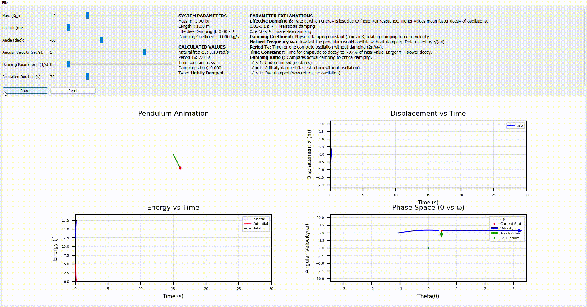
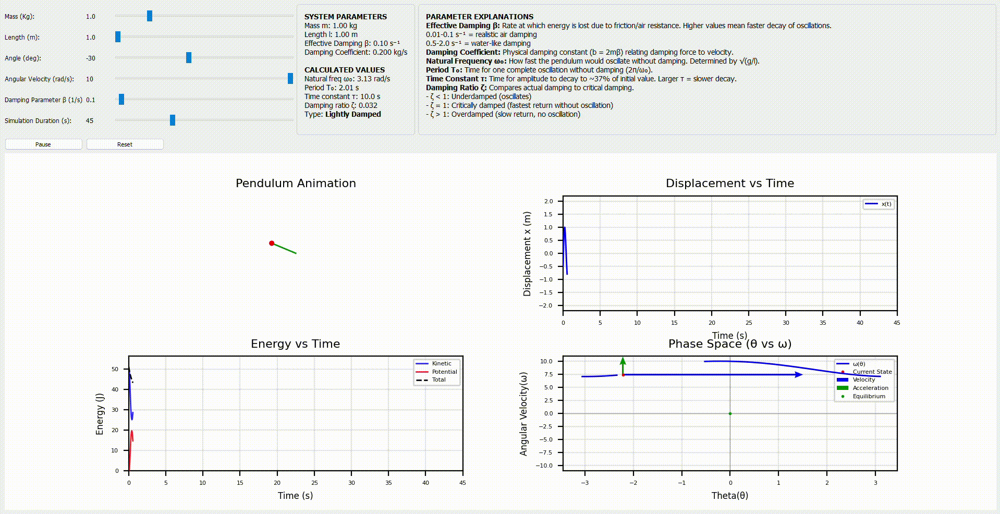
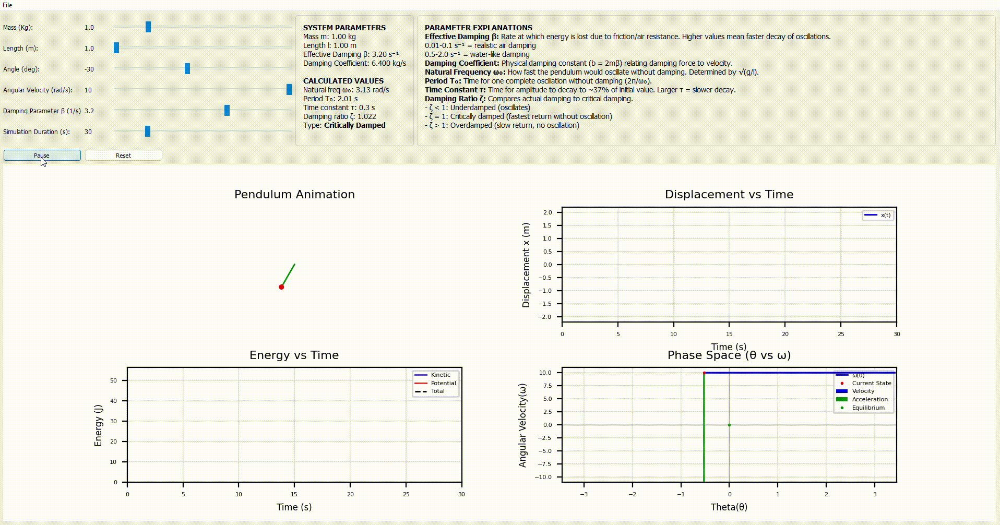

# Damped Pendulum Simulator

An interactive physics simulation of a damped pendulum with real-time visualization, built using Python, PyQt5, and Matplotlib.

This Project was actually not supposed to be this big. I saw a youtube video(I have linked it down below) about solving differential equations symbolically with sympy. I thought why not use
that and make a pendulum visualisation. As I started making it, I found more and more things that could be
done with it, and just kept on adding features by searching the Internet and whatnot, without considering the architecture. Now, it's become a bit problematic, kind of unreadable and I dont want to waste effort trying to modularise this now.
I have tried my best to explain the code with comments but yeah, its not ideal.
I have learnt a lot through this project. I will implement
my learnings in the next project that I make. So it is what it is now.

## Demo

### Example Simulations



Undamped Pendulum Oscillations showing transfer between kinetic and potential energy



Lightly Damped



Critically Damped

## Features

- **Real-time Interactive Controls**: Adjust mass, length, initial angle, initial velocity, damping, and simulation duration with sliders
- **Multiple Visualizations**:
  - Animated pendulum motion
  - Displacement vs. time graph
  - Energy analysis (kinetic, potential, and total energy)
  - Phase space diagram (θ vs ω) with velocity and acceleration vectors
- **Physics Analysis**: Displays natural frequency, period, time constant, damping ratio, and damping classification
- **Auto-stop**: Automatically stops when oscillations decay below threshold
- **Play/Pause/Reset Controls**: Full control over animation playback

## Physics Background

This simulator solves the damped pendulum equation of motion using the [Lagrangian mechanics](https://en.wikipedia.org/wiki/Lagrangian_mechanics#Examples) with Rayleigh dissipation to
arrive at the final equation:
d²θ/dt² + 2β(dθ/dt) + (g/l)sin(θ) = 0

Where:

- θ = angular displacement(rad)
- β = effective damping coefficient(1/s)
- g = gravitational acceleration (9.81 m/s²)
- l = string length(m)

The system classifies damping into four types based on the damping ratio ζ = β/ω₀:

- **Lightly Damped** (ζ < 0.1): Minimal energy loss
- **Underdamped** (0.1 ≤ ζ < 1): Oscillates with decaying amplitude
- **Critically Damped** (0.9 ≤ ζ ≤ 1.1): Fastest return to equilibrium without oscillation
- **Overdamped** (ζ > 1.1): Slow return to equilibrium, no oscillation

## Installation

### Prerequisites

- Python 3.7 or higher
- pip (Python package manager)

### Required Libraries

```bash
pip install numpy scipy sympy matplotlib PyQt5
```

Or install all dependencies at once:

```bash
pip install -r requirements.txt
```

### Clone the Repository

```bash
git clone https://github.com/charun0881/damped-pendulum-simulator.git
cd damped-pendulum-simulator
```

## Usage

Run the simulator:

```bash
python main.py
```

### Controls

**Sliders:**

- **Mass**: Adjust pendulum bob mass (0.1 - 5.0 kg)
- **Length**: Adjust pendulum rod length (1.0 - 2.0 m)
- **Angle**: Set initial angular displacement (-170° to 170°)
- **Angular Velocity**: Set initial angular velocity (-10 to 10 rad/s)
- **Damping β**: Adjust effective damping coefficient (0 - 5.0 s⁻¹)
- **Simulation Duration**: Set total simulation time (10 - 120 seconds)

**Buttons:**

- **Start/Pause**: Begin or pause the animation
- **Reset**: Return all parameters to default values

### Understanding the Visualizations

1. **Pendulum Animation (Top Left)**: Shows the real-time motion of the pendulum
2. **Displacement vs Time (Top Right)**: Plots horizontal displacement over time
3. **Energy vs Time (Bottom Left)**: Shows kinetic (blue), potential (red), and total (black dashed) energy
4. **Phase Space (Bottom Right)**:
   - Blue trajectory: Trajectory through state space
   - Red dot: Current state
   - Blue arrow: Angular velocity vector
   - Green arrow: Angular acceleration vector

## Known Limitations

- Lacks proper file architecture and data flow
- Uses symbolic derivation on every call
- Solves the ODE on every slider value update
- No vector field in the phase portrait(havent understood it yet)

## Future Improvements

- Design the Project architecture before starting to make one
- Better Documentation
- Define Magic numbers as configuration constants
- Cache any symbolic derivations for faster computation
- Better data encapsulation
- Methods with one specific purporse
- Check for input validation
- Export animation to video/GIF

## License

MIT

## References

- [Sympy Logic](https://youtu.be/xuxCk-VrF8c)

---
